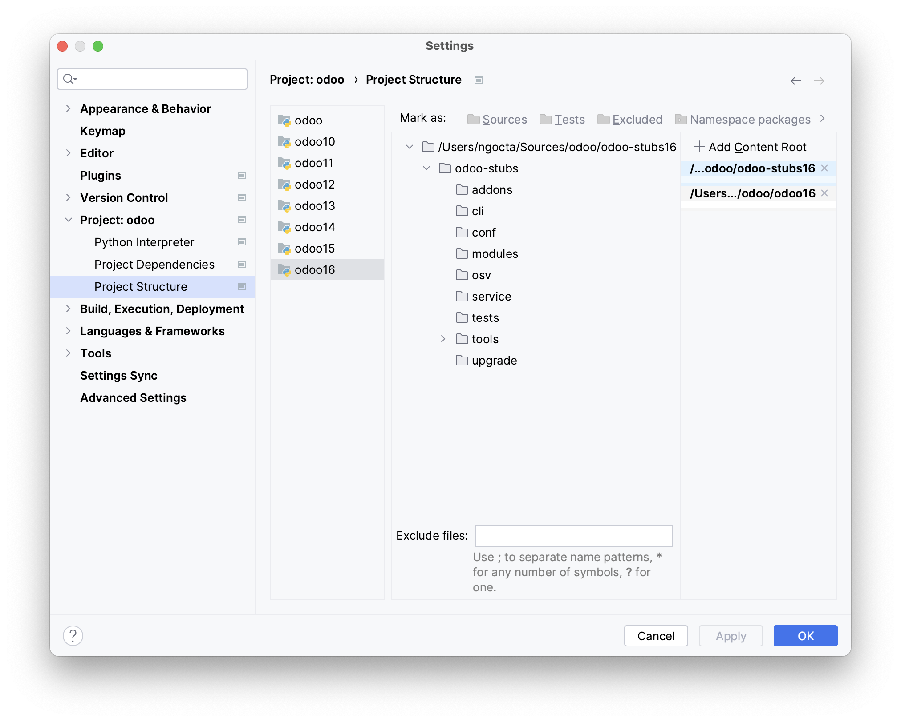
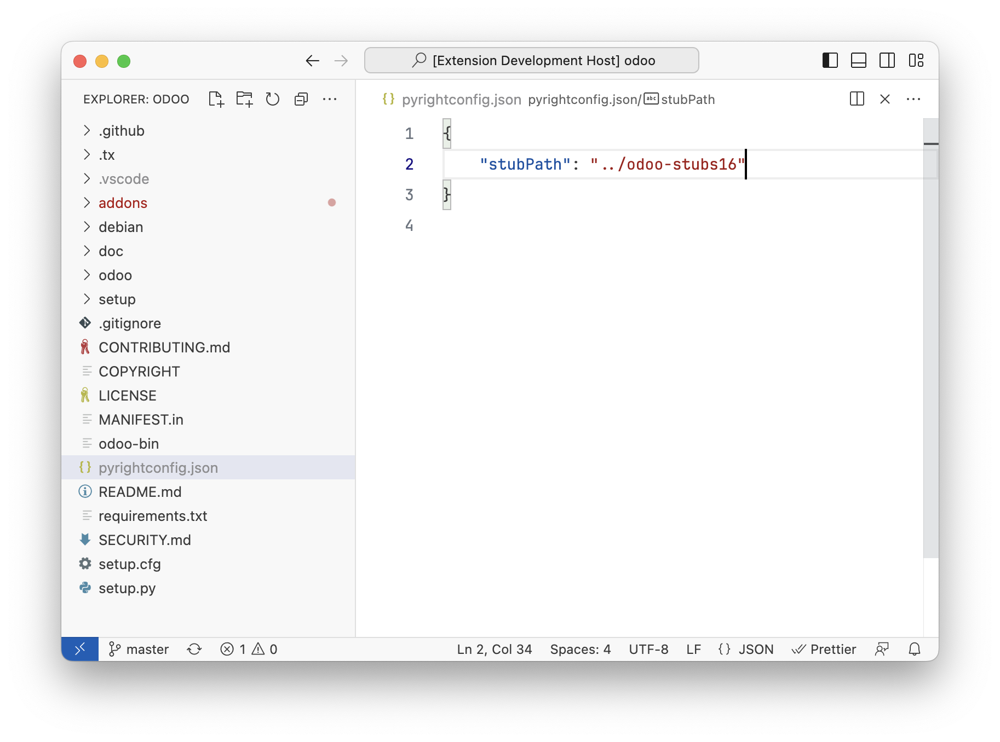

# Odoo Stubs

> A stub file is a file containing a skeleton of the public interface of that Python module,
> including classes, variables, functions – and most importantly, their types.
>
> https://mypy.readthedocs.io/en/stable/stubs.html 

By using these stubs, IDEs will provide better code completion,
and static type checkers will provide better reports.

## Usage

If you are using the [PyCharm plugin for Odoo](https://plugins.jetbrains.com/plugin/13499-odoo) or
the [VSCode extension for Odoo](https://marketplace.visualstudio.com/items?itemName=trinhanhngoc.vscode-odoo),
then you don't need to setup Odoo Stubs manually as they already have built-in Odoo Stubs.
If not, you can follow these instructions for manually setup.

### 1. Clone the branch corresponding to the Odoo version

Example, for Odoo 16:
```
git clone -b 16.0 https://github.com/odoo-ide/odoo-stubs.git odoo-stubs16
```

### 2. Configure IDEs

#### PyCharm

First make sure you have attached the [Odoo source code](https://github.com/odoo/odoo)
to your project.
Then open `Settings > Project > Project Structure`,
select the project containing the Odoo source code and click `Add Content Root` to add the odoo-stubs folder.



#### Visual Studio Code

Add the odoo-stubs folder to the `stubPath` or `extraPaths` settings as described in the
[import resolution documentation](https://microsoft.github.io/pyright/#/import-resolution).


